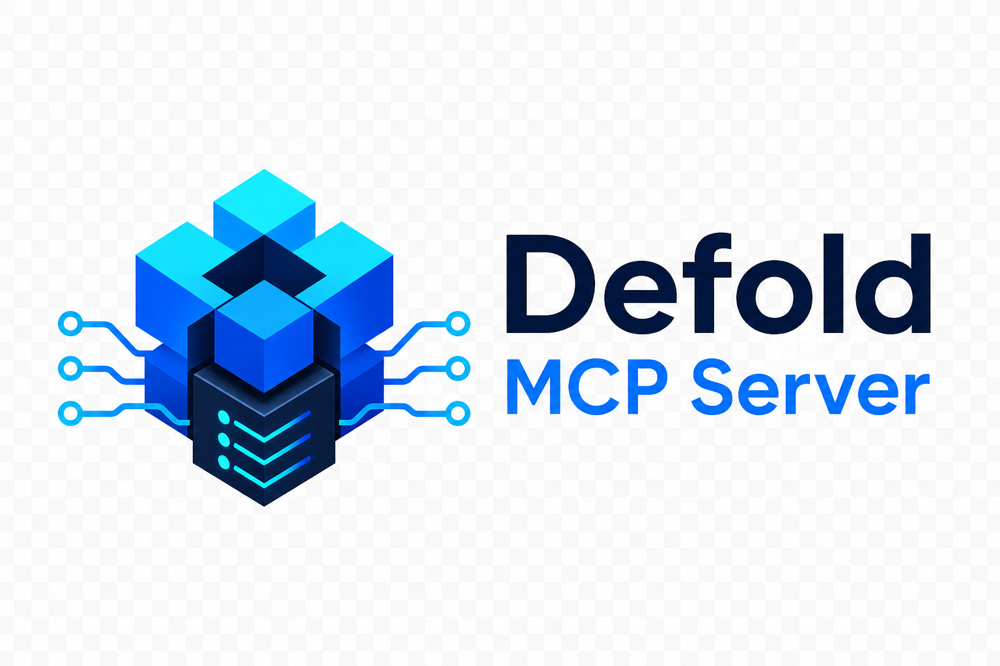

<p align="center">
  
</p>

# defold-mcp-server

An [MCP](https://modelcontextprotocol.io) server that gives AI coding agents first-class access to the [Defold](https://defold.com) game engine: inspect and edit projects, build and bundle with bob, run games locally, hot-reload code into a live game, drive the running engine, and search the official API reference.

Everything works headlessly — no Defold editor required. A [desktop app](desktop) manages the server, streams its activity to a live console, and auto-configures your AI agents.

## Features

- **Project intelligence** — parse `game.project`, collections, game objects, GUI scenes, atlases and any other text-format resource into structured JSON; outline Lua scripts (functions, `go.property` definitions, requires, handled messages); find references to any asset before renaming or deleting it.
- **Build pipeline** — download/cache `bob.jar` per Defold version, compile with structured error diagnostics (resource, line, message), bundle for all supported platforms, resolve dependencies.
- **Run & debug loop** — download/cache the `dmengine` dev binary, launch the game in the background, read its logs incrementally, stop it gracefully.
- **Live engine control** — hot reload changed scripts/resources into the running game (the same mechanism the editor uses), toggle the profiler and physics debug, set frame cap and vsync, record gameplay video, reboot or exit the engine, and stream engine logs over TCP — including from editor-launched games and devices on the network.
- **API documentation** — search and read the official Defold API reference for the exact engine version you build with (go, gui, msg, sys, physics, render, editor scripting, native extension SDK, ...).

## Requirements

- **Node.js >= 18**
- **Java (JDK 17+, 21+ recommended)** — only for the build tools (`defold_build`, `defold_bundle`, `defold_resolve_dependencies`). Everything else works without Java. Install from [Adoptium](https://adoptium.net) or `brew install openjdk`.
- Network access on first use of a Defold version (downloads `bob.jar`, `dmengine`, API docs from official Defold servers into `~/.defold-mcp`).

## Installation

```bash
git clone https://github.com/Fulviuus/defold-mcp.git && cd defold-mcp
npm install
npm run build   # produces dist/index.js
npm test        # optional: 46 unit + end-to-end tests
```

## Desktop app (recommended for multi-agent setups)

A Tauri app in [`desktop/`](desktop) manages the server for you: a live console of
everything the server does (every tool call, build output, engine logs), start/stop
with a chosen host/port, and one-click configuration of AI agents (Claude Code,
Claude Desktop, Codex CLI, Cursor, Gemini CLI, VS Code Copilot, Windsurf, Cline, Zed).

```bash
cd desktop
npm install
npm run dev      # run the app (requires Rust toolchain)
npm run build    # produce a distributable bundle (.app / .msi / .deb)
```

In the app: pick host/port → **Start server** → choose an agent from the dropdown →
**Configure**. The app merges a `defold` entry into that agent's own config file
(backing up the original) pointing at `http://127.0.0.1:<port>/mcp`. All connected
agents share this one server instance, and its activity streams into the console.

## Transports

The server speaks both MCP transports:

- **stdio** (default) — the client spawns the server itself: `node dist/index.js`
- **Streamable HTTP** — one long-lived server many clients connect to:
  `node dist/index.js --transport http --host 127.0.0.1 --port 9810`
  (MCP endpoint at `/mcp`, status at `/health`). This is what the desktop app runs.
  DNS-rebinding protection is enabled on loopback binds; binding `0.0.0.0` is
  possible for LAN use but exposes the endpoint to your network — only do this on
  trusted networks.

### Claude Code

```bash
claude mcp add defold -- node /path/to/defold-mcp/dist/index.js
```

or in `.mcp.json`:

```json
{
  "mcpServers": {
    "defold": {
      "command": "node",
      "args": ["/path/to/defold-mcp/dist/index.js"],
      "env": { "DEFOLD_PROJECT_ROOT": "/path/to/your/game" }
    }
  }
}
```

### OpenAI Codex CLI

```bash
codex mcp add defold \
  --env DEFOLD_PROJECT_ROOT=/path/to/your/game \
  --env JAVA_HOME=/opt/homebrew/opt/openjdk/libexec/openjdk.jdk/Contents/Home \
  -- node /path/to/defold-mcp/dist/index.js
```

or in `~/.codex/config.toml`:

```toml
[mcp_servers.defold]
command = "node"
args = ["/path/to/defold-mcp/dist/index.js"]
startup_timeout_sec = 30   # default 10
tool_timeout_sec = 600     # default 60 — too short for defold_build/defold_bundle

[mcp_servers.defold.env]
DEFOLD_PROJECT_ROOT = "/path/to/your/game"
JAVA_HOME = "/opt/homebrew/opt/openjdk/libexec/openjdk.jdk/Contents/Home"
```

Two Codex-specific gotchas:

- **Raise `tool_timeout_sec`** (default 60 s): first builds download platform packages and can run for minutes; Codex kills slower tool calls.
- **Codex sanitizes the server environment** (only `HOME`, `PATH`, `USER`, ... survive). `JAVA_HOME` and `DEFOLD_PROJECT_ROOT` are *not* inherited from your shell — set them in the `env` table, or whitelist shell vars with `env_vars = ["JAVA_HOME"]`.

### Gemini CLI

```bash
gemini mcp add -s user \
  -e DEFOLD_PROJECT_ROOT=/path/to/your/game \
  -e JAVA_HOME=/opt/homebrew/opt/openjdk/libexec/openjdk.jdk/Contents/Home \
  defold node /path/to/defold-mcp/dist/index.js
```

(or the same `mcpServers` JSON block as Claude Desktop in `~/.gemini/settings.json`; note `gemini mcp add` defaults to *project* scope — `-s user` makes it global. Per-server `"timeout"` is in ms, default 600000.)

### Cursor / Claude Desktop / Windsurf / Cline

All use the same `mcpServers` JSON shape — only the file location differs:

| Client | File |
|---|---|
| Cursor | `.cursor/mcp.json` (project) or `~/.cursor/mcp.json` (global) |
| Claude Desktop | `claude_desktop_config.json` |
| Windsurf | `~/.codeium/windsurf/mcp_config.json` |
| Cline | Cline panel → MCP Servers → Configure (`cline_mcp_settings.json`) |

```json
{
  "mcpServers": {
    "defold": {
      "command": "node",
      "args": ["/path/to/defold-mcp/dist/index.js"],
      "env": {
        "DEFOLD_PROJECT_ROOT": "/path/to/your/game",
        "JAVA_HOME": "/opt/homebrew/opt/openjdk/libexec/openjdk.jdk/Contents/Home"
      }
    }
  }
}
```

In Cursor, `"DEFOLD_PROJECT_ROOT": "${workspaceFolder}"` works. Cursor only forwards ~40 tools to the agent across all servers — disable unused servers if you hit the cap.

### VS Code (GitHub Copilot agent mode)

`.vscode/mcp.json` — note the top-level key is `servers`, not `mcpServers`:

```json
{
  "servers": {
    "defold": {
      "type": "stdio",
      "command": "node",
      "args": ["/path/to/defold-mcp/dist/index.js"],
      "env": { "DEFOLD_PROJECT_ROOT": "${workspaceFolder}" }
    }
  }
}
```

### Zed

`~/.config/zed/settings.json` — Zed calls them `context_servers`:

```json
{
  "context_servers": {
    "defold": {
      "command": "node",
      "args": ["/path/to/defold-mcp/dist/index.js"],
      "env": { "DEFOLD_PROJECT_ROOT": "/path/to/your/game" }
    }
  }
}
```

### Any other MCP client

The server is a standard stdio MCP server, so anything that speaks MCP works. You only ever configure three things:

1. **Launch**: `node /path/to/defold-mcp/dist/index.js`
2. **`DEFOLD_PROJECT_ROOT`** (optional): if the agent's working directory is inside the game project, the server finds `game.project` by walking upward and no env var is needed.
3. **`JAVA_HOME`** (optional): only needed for `defold_build`/`defold_bundle`/`defold_resolve_dependencies` when `java` is not on the PATH the client gives the server.

If the client enforces per-tool timeouts, raise them for the build tools (first builds can take minutes).

### Environment variables

| Variable | Purpose |
|---|---|
| `DEFOLD_PROJECT_ROOT` | Default project root (directory containing `game.project`). Tools also accept an explicit `project_root` argument, and fall back to searching upward from the working directory. |
| `DEFOLD_MCP_CACHE_DIR` | Toolchain cache directory (default `~/.defold-mcp`). |
| `JAVA_HOME` | JDK used to run bob.jar (otherwise `java` from PATH). |
| `DEFOLD_EMAIL` / `DEFOLD_AUTH` | Defaults for `bob resolve` against private dependency hosts. |

## Tools

### Project & settings
| Tool | Description |
|---|---|
| `defold_project_info` | Project overview: title, main collection, display, dependencies, resource counts. |
| `defold_get_settings` | Read game.project (all sections / one section / one key). |
| `defold_set_setting` | Set or remove a game.project key, preserving formatting. Auto-appends the trailing `c` for compiled-resource keys (see below). |
| `defold_list_dependencies` | Declared dependencies + locally resolved archives. |
| `defold_add_dependency` / `defold_remove_dependency` | Manage dependency URLs. |

### Resources
| Tool | Description |
|---|---|
| `defold_list_resources` | List project files by type/name with pagination. |
| `defold_parse_resource` | Parse any resource to JSON (collections, .go, .gui, atlases, ...; Lua outline for scripts; sections for game.project). |
| `defold_create_resource` | Scaffold script / gui_script / render_script / lua / go / collection / gui / atlas / input_binding from valid templates. |
| `defold_find_references` | Find files referencing an asset (also dotted `require` form for Lua modules). |

### Build & toolchain
| Tool | Description |
|---|---|
| `defold_setup` | Install/verify Java, bob.jar, dmengine and API docs for a Defold version (`stable`, `beta`, `alpha` or `1.12.4`). |
| `defold_build` | `bob build` with structured error/warning diagnostics. |
| `defold_bundle` | Platform bundles (macOS/Windows/Linux/Android/iOS/HTML5); signing flags via `extra_args`. |
| `defold_resolve_dependencies` | `bob resolve`. |
| `defold_clean` | Delete build output. |
| `defold_doctor` | Environment diagnosis (Java, cache, project root, running games). |

### Run & live engine
| Tool | Description |
|---|---|
| `defold_run` | Build + launch the game with the dmengine dev binary (background). |
| `defold_stop` | Stop the launched game. |
| `defold_game_logs` | Read captured stdout/stderr incrementally (stable offsets, filtering). |
| `defold_engine_info` | `/info` + ping of a running engine (local or device). |
| `defold_hot_reload` | Compile and hot-swap resources into the running game. |
| `defold_engine_command` | `@system` commands: toggle_profile, toggle_physics_debug, set_update_frequency, set_vsync, start/stop_record, reboot, exit, ... |
| `defold_engine_logs` | Stream the engine TCP log service (works for editor-launched games and devices too). |
| `defold_editor_logs` | Stream the running Defold editor's console (build + engine output) via its `/console/stream` HTTP endpoint (Defold 1.13.0+). |

### API reference
| Tool | Description |
|---|---|
| `defold_api_search` | Ranked search across the full API reference for a given engine version. |
| `defold_api_doc` | Full docs for an element (`go.animate`) or a namespace index (`go`), with parameters, returns and examples. |

## Typical agent workflow

```
defold_setup                          # once: verify Java, fetch bob + engine + docs
defold_project_info                   # orient
defold_parse_resource /main/main.collection
... edit files with normal file tools ...
defold_build                          # structured compile errors
defold_run                            # launch
defold_hot_reload ["/main/player.script"]   # iterate without restarting
defold_game_logs filter="ERROR"       # observe
defold_stop
```

## Defold-specific notes

- **Trailing `c` convention**: `game.project` stores some bootstrap resources in *compiled* form — `bootstrap.main_collection = /main/main.collectionc` (note the `c`). `defold_set_setting` appends it automatically for the six affected keys (`bootstrap.main_collection`, `bootstrap.render`, `bootstrap.debug_init_script`, `input.game_binding`, `input.gamepads`, `display.display_profiles`).
- **Hot reload** maps source paths to built paths (`.script` → `.scriptc`, `.atlas` → `.texturesetc`, images → `.texturec`, ...) and posts them to the engine service (`POST /post/@resource/reload`, binary protobuf) — the same protocol the editor uses. It requires a **debug** build whose `build/default` output is in sync with the running game.
- **Engine service**: debug builds listen on port 8001 (`/info`, `/ping`, `/post/...`). For devices, pass the device IP as `host`.
- **Native extensions**: projects with native-code dependencies are compiled via Defold's cloud build servers when bob builds; this happens transparently but requires network access.

## Security notes

- The server is a **local development tool over stdio**; it does not listen on any network port.
- File-writing tools resolve paths against the project root and reject traversal outside it.
- Toolchain artifacts are downloaded only from `d.defold.com` and `github.com/defold/defold` releases, and cached locally.
- `defold_engine_*` tools talk to whatever host you point them at (default `localhost`); they send engine control messages, never project source.

## Development

```bash
npm run dev          # run from TypeScript sources
npm test             # build + unit & e2e tests (no Java/network needed)
node test/live-smoke.mjs          # live network smoke (downloads toolchain, queries real docs)
node test/live-smoke.mjs --full   # + real build/run/hot-reload loop (needs Java)
```

Test layout: `test/fixture` is a minimal valid Defold project; `test/server.test.mjs` drives the server through a real MCP stdio client, with a fake engine HTTP/TCP service standing in for a running game.

## License

MIT
